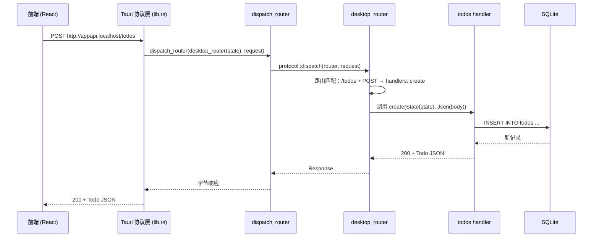

# 路由系统说明

> 本文说明 `src-tauri/src/` 下的路由组装与请求分发机制，涵盖桌面协议、浏览器联调与集成测试三种运行环境。

---

## 0. 概述

后端以单一业务逻辑（待办 CRUD）为核心，其路由被三种运行环境复用，仅在外围组装上存在差异：

| 环境 | 入口 | 传输方式 |
|------|------|----------|
| 桌面 App | `tauri dev` | 进程内自定义协议 `appapi`，不监听 TCP 端口 |
| 浏览器联调 | `api:dev`（`127.0.0.1:8787`） | `axum::serve` 启动 HTTP 服务器 |
| 集成测试 | `cargo test` | 内存内 `oneshot`，不涉及网络 |

设计原则：业务路由定义一次，各环境在此基础上叠加不同的外围层。

---

## 1. 基本概念

### 1.1 `Router`

axum 的 `Router` 负责将请求路径与方法映射到 handler：

```rust
Router::new()
    .route("/health", get(health::health))
    .nest("/todos", todos::routes())
```

- `.route(path, method_handler)`：注册「路径 + 方法」到 handler 的映射。
- `.nest(prefix, router)`：将子路由挂载到指定前缀下，子路由路径自动拼接前缀。

### 1.2 handler

handler 是处理请求的异步函数，通过提取器（extractor）获取请求数据与共享状态：

```rust
pub async fn list(State(state): State<AppState>) -> ApiResult<Json<Vec<Todo>>> {
    // ...
}
```

`State<AppState>` 是 axum 的状态提取器，从路由的共享状态中取出 `AppState`。

### 1.3 `AppState`

多个 handler 需要访问同一个数据库连接，因此数据库被封装进全局共享的 `AppState`。handler 通过 `State(state)` 提取器获取它。

---

## 2. 路由组装

代码位于 `src-tauri/src/api/mod.rs` 与 `src-tauri/src/window_chrome.rs`。

### 2.1 `stateful_router()` —— 业务路由骨架

```rust
pub(crate) fn stateful_router() -> Router<AppState> {
    Router::new()
        .route("/health", get(health::health))
        .nest("/todos", todos::routes())
}
```

- 返回 `Router<AppState>`，表示其 handler 依赖 `AppState`，此时状态尚未注入。
- `pub(crate)`：仅 crate 内部可见，避免外部绕过约束直接拼装。
- 这是唯一的业务路由定义处；新增资源应在 `todos` 同级登记。

### 2.2 `cors_layer()` —— 共享 CORS 策略

```rust
pub(crate) fn cors_layer() -> CorsLayer {
    CorsLayer::new()
        .allow_origin(Any)
        .allow_methods(Any)
        .allow_headers(Any)
}
```

浏览器同源策略会拦截跨域请求（前端 `localhost:1420` 调 API `127.0.0.1:8787`）。该函数抽出统一的 CORS 配置，供 `app_router` 与 `desktop_router` 复用，避免配置漂移。

### 2.3 `app_router(state)` —— 组装标准 API

```rust
pub fn app_router(state: AppState) -> Router {
    stateful_router().layer(cors_layer()).with_state(state)
}
```

链式调用顺序：

1. `stateful_router()` 得到 `Router<AppState>`；
2. `.layer(cors_layer())` 叠加 CORS 中间件；
3. `.with_state(state)` 注入 `AppState` 实例。

关键点：`.with_state(state)` 会消费泛型状态，`Router<AppState>` 因此收口为 `Router`（即 `Router<()>`），返回类型不再携带状态参数。

### 2.4 `desktop_router(state)` —— 桌面专属扩展

位于 `src-tauri/src/window_chrome.rs`：

```rust
pub fn desktop_router(state: AppState) -> Router {
    crate::api::stateful_router()
        .nest("/ui/window-chrome", routes())
        .layer(crate::api::cors_layer())
        .with_state(state)
}
```

为桌面 App 组装「业务路由 + 窗口主题路由」。

**为何不能复用 `app_router`**：`app_router` 已执行 `.with_state(state)`，返回 `Router`（已注入状态）。此时再 `.nest` 一个仍需 `AppState` 的子路由，类型不匹配（`Router<()>` vs `Router<AppState>`）。因此 `desktop_router` 必须在 `.with_state` 之前完成路由挂载，顺序为：

```
骨架 → 挂窗口路由 → 套 CORS → 注入 state
```

**为何置于 `window_chrome.rs` 而非 `api/mod.rs`**：窗口主题路由依赖 `tauri` 类型（`WebviewWindow`、`Theme`），而 `tauri` 会引入 WebView2 等原生依赖。若放入 `api` 模块，集成测试二进制也会链接到 WebView2，导致 Windows 上测试启动失败（`STATUS_ENTRYPOINT_NOT_FOUND`）。

分层原则：

```
api 模块（src-tauri/src/api/）    → 纯后端，零 tauri 依赖
window_chrome.rs（crate 根）      → 桌面专属，依赖 tauri
```

### 2.5 `dispatch_router()` —— 协议分发入口

```rust
pub async fn dispatch_router(
    router: Router,
    request: http::Request<Vec<u8>>,
) -> http::Response<Vec<u8>> {
    protocol::dispatch(router, request).await
}
```

- 通用分发器：接收任意路由与请求，返回响应。桌面进程传入 `desktop_router`。
- 存在必要性：`protocol` 模块声明为私有（`mod protocol;`），`lib.rs` 无法直接访问 `protocol::dispatch`，该 `pub` 函数构成对外暴露私有能力的边界。

### 2.6 `protocol::dispatch` —— 执行实现

位于 `src-tauri/src/api/protocol.rs`：

```rust
pub async fn dispatch(router: Router, request: http::Request<Vec<u8>>) -> Response<Vec<u8>> {
    // 入参转换：Tauri 传入 body 为字节数组，axum 需要 axum::body::Body
    let (parts, body) = request.into_parts();
    let request = Request::from_parts(parts, Body::from(body));

    // 核心：将路由作为一次性服务，内存内完成一次请求-响应，不监听端口
    let response = match router.oneshot(request).await {
        Ok(response) => response,
        Err(_) => /* 500 */,
    };

    // 出参转换：响应体读为字节数组，交还 Tauri
    let (parts, body) = response.into_parts();
    let bytes = body.collect().await.map(|c| c.to_bytes().to_vec()).unwrap_or_default();
    Response::from_parts(parts, bytes)
}
```

`router.oneshot(request)` 源自 tower 的 `ServiceExt::oneshot`，将路由作为一次性服务在内存内调用一次，不监听端口、不起 TCP，是「桌面不监听 TCP」的实现基础。

---

## 3. 请求处理链路（以「新增待办」为例）

前端发起请求：

```ts
fetch("http://appapi.localhost/todos", {
  method: "POST",
  body: JSON.stringify({ title: "买牛奶" }),
})
```

处理链路：



处理步骤：

1. 前端发起 `fetch`，请求地址为 `http://appapi.localhost/todos`。
2. Tauri 协议层（`lib.rs`）拦截该自定义协议请求。
3. `desktop_router` 已组装完成，`dispatch_router` 将其与请求一并交给 `protocol::dispatch`。
4. axum 将请求路由到 `POST /todos` 对应的 `handlers::create`。
5. handler 通过 `State(state)` 获取 `AppState`，在 `Mutex` 保护下执行 SQLite 写操作。
6. 响应沿调用链返回，前端收到 `200` 与新建的 `Todo` JSON。

---

## 4. 三种环境路由对照

| 环境 | 路由 | 窗口主题 | 文档 UI | 传输方式 |
|------|------|---------|---------|---------|
| 桌面 App | `desktop_router` | 是 | 否 | 进程内协议 + `oneshot` |
| 浏览器联调 | `app_router` + Scalar | 否 | 是 | TCP `127.0.0.1:8787` |
| 集成测试 | `app_router` + 临时库 | 否 | 否 | 内存 `oneshot` |

### 桌面 App（`lib.rs`）

```rust
let response = api::dispatch_router(
    window_chrome::desktop_router(api::shared_state()),
    request,
).await;
```

### 浏览器联调（`src/bin/api.rs`）

```rust
let app = app_router(shared_state())
    .merge(Scalar::with_url("/scalar", ApiDoc::openapi()))   // 附加文档 UI
    .route("/api-docs/openapi.json", get(...));
axum::serve(listener, app).await;                            // 真正监听 TCP
```

### 集成测试（`tests/todos_api.rs`）

```rust
let state = AppState::with_db_path(db.path());   // 临时库，不污染开发数据
let app = app_router(state);
app.oneshot(req).await;
```

---

## 5. FAQ

### Q1：`Router<AppState>` 与 `Router` 有何区别？

`Router<AppState>` 表示状态尚未注入；`Router`（即 `Router<()>`）表示状态已注入完毕。

流程：构造 `Router<AppState>` → 挂载路由与中间件 → `.with_state(state)` 收口为 `Router`。

### Q2：`.nest` 与 `.merge` 有何区别？

- `.nest(prefix, router)`：将子路由挂到路径前缀下（`/todos` + `/{id}` → `/todos/{id}`）。
- `.merge(router)`：并列合并两个路由，路径互不改变（用于「业务路由 + 文档路由」等互不相干的组合）。

### Q3：`.layer` 与 `.with_state` 的顺序有要求吗？

有。常规顺序：先挂路由，再套中间件（`layer`），最后注入状态（`with_state`）。

原因：`.with_state` 会消费泛型状态，之后无法再挂载仍需状态的路由，因此所有路由必须在 `with_state` 之前完成。

### Q4：为何桌面 App 不监听 HTTP 端口？

桌面 App 仅需前端与后端之间的进程内通信，无对外服务需求。采用 Tauri 自定义协议 `appapi` + `oneshot` 在进程内完成，安全性与性能更优，且不存在端口冲突。`axum::serve` 仅用于浏览器联调 `api:dev`。

### Q5：为何集成测试使用临时数据库？

避免污染开发数据库。测试通过 `AppState::with_db_path(临时路径)` 构造独立临时库，跑完即弃。

---

## 6. 相关文件索引

| 文件 | 职责 |
|------|------|
| `src-tauri/src/api/mod.rs` | `stateful_router` / `cors_layer` / `app_router` / `dispatch_router` |
| `src-tauri/src/api/protocol.rs` | `dispatch`：协议请求到 axum oneshot 的执行细节 |
| `src-tauri/src/window_chrome.rs` | `desktop_router`：桌面专属路由组装 |
| `src-tauri/src/lib.rs` | 注册 `appapi` 协议，请求转交 `dispatch_router` |
| `src-tauri/src/bin/api.rs` | 浏览器联调 HTTP 服务器（`app_router` + Scalar） |
| `src-tauri/tests/todos_api.rs` | `app_router` + 临时库的集成测试 |
